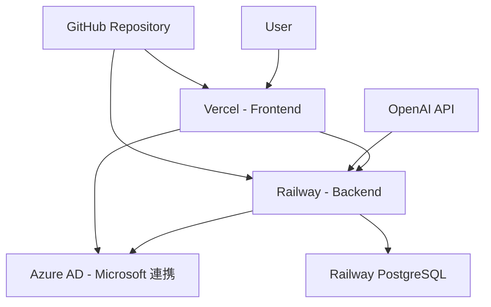

# 本番環境統合デプロイガイド

## 🚀 デプロイフロー概要

本ガイドでは、無料プランでPMOエージェントを本番環境にフルデプロイする手順を説明します。

### 推奨デプロイ構成



## 📋 前提条件チェックリスト

デプロイ開始前に以下が完了していることを確認：

- [ ] [OpenAI API設定](./01-openai-api-setup.md) 完了
- [ ] [Azure AD設定](./02-azure-ad-setup.md) 完了  
- [ ] [ローカル環境](./03-environment-setup.md) 動作確認済み
- [ ] GitHub リポジトリにコードがプッシュ済み
- [ ] GitHubアカウントでVercel・Railway登録済み

## 🎯 デプロイフロー（推奨順序）

### Phase 1: フロントエンドデプロイ
**所要時間: 30分**

1. **[フロントエンド Vercel デプロイ](./06-frontend-deployment-vercel.md)**
   - Vercel プロジェクト作成
   - 環境変数設定（仮のAPI URL）
   - 初回デプロイ実行

**成果物**:
```
✅ https://pmo-agent-frontend.vercel.app
✅ ログイン画面表示（API接続エラーは正常）
```

### Phase 2: バックエンドデプロイ  
**所要時間: 45分**

2. **[バックエンド Railway デプロイ](./07-backend-deployment-railway.md)**
   - Railway プロジェクト作成
   - PostgreSQL データベース作成
   - 環境変数設定
   - デプロイ実行
   - データベースマイグレーション

**成果物**:
```
✅ https://pmo-agent-backend-production-xxxx.up.railway.app
✅ /health エンドポイント応答
✅ /docs Swagger UI 表示
```

### Phase 3: 連携設定更新
**所要時間: 15分**

3. **統合設定の更新**
   - Vercel環境変数にRailway URLを設定
   - Azure AD リダイレクトURIを更新
   - CORS設定を更新

### Phase 4: 動作検証
**所要時間: 30分**

4. **[本番環境テスト](./10-production-testing.md)**
   - 基本機能テスト
   - Microsoft連携テスト
   - OpenAI API テスト

## 🔧 詳細デプロイ手順

### Step 1: フロントエンドデプロイ

#### 1.1 Vercel プロジェクト作成

```bash
# Vercel CLI インストール・ログイン
npm install -g vercel
vercel login

# プロジェクトディレクトリで初期化
cd packages/frontend
vercel

# 設定
? Project Name: pmo-agent-frontend
? Framework: Vite
? Root Directory: ./
? Build Command: pnpm build
? Output Directory: dist
```

#### 1.2 環境変数設定（Vercel）

```env
# 一時的なURL（後で更新）
VITE_API_URL=https://pmo-agent-backend-temp.railway.app
VITE_WEBSOCKET_URL=wss://pmo-agent-backend-temp.railway.app
VITE_MOCK_MODE=false
VITE_ENABLE_AI_FEATURES=true
VITE_ENABLE_EMAIL_SYNC=true
VITE_ENVIRONMENT=production
```

#### 1.3 デプロイ実行

```bash
vercel --prod
```

**期待される結果**:
```
✅ Production: https://pmo-agent-frontend.vercel.app
✅ ログイン画面が表示される
⚠️ API接続エラー（正常、バックエンド未デプロイのため）
```

### Step 2: バックエンドデプロイ

#### 2.1 Railway プロジェクト作成

```bash
# Railway CLI インストール・ログイン  
npm install -g @railway/cli
railway login

# バックエンドディレクトリで初期化
cd packages/backend
railway init pmo-agent-backend
```

#### 2.2 必要ファイルの作成

**📁 Procfile**:
```
web: uvicorn app.main:app --host 0.0.0.0 --port $PORT
```

**📁 start.sh**:
```bash
#!/bin/bash
alembic upgrade head
uvicorn app.main:app --host 0.0.0.0 --port ${PORT:-8000}
```

**📁 railway.toml**:
```toml
[build]
builder = "NIXPACKS"

[deploy]
healthcheckPath = "/health"
healthcheckTimeout = 300
```

#### 2.3 PostgreSQL データベース追加

Railway ダッシュボードで：
1. 「+ New」→「Database」→「PostgreSQL」
2. 自動的に `DATABASE_URL` 環境変数が設定される

#### 2.4 環境変数設定（Railway）

```env
# アプリケーション基本設定
PROJECT_NAME=PMO Agent
VERSION=1.0.0
DEBUG=false
ENVIRONMENT=production
SECRET_KEY=[生成した64文字のランダム文字列]

# データベース（自動設定）
DATABASE_URL=${{Postgres.DATABASE_URL}}

# OpenAI設定  
USE_OPENAI=true
OPENAI_API_KEY=sk-proj-xxxxxxxxxxxxxxxxxxxxxxxxxxxxx
OPENAI_MODEL=gpt-3.5-turbo
OPENAI_MAX_TOKENS=1000
OPENAI_TEMPERATURE=0.3

# Microsoft設定
OUTLOOK_ENABLED=true
MICROSOFT_CLIENT_ID=12345678-1234-1234-1234-123456789abc
MICROSOFT_CLIENT_SECRET=~8Q8~.xxxxxxxxxxxxxxxxxxxxx
MICROSOFT_TENANT_ID=common
MICROSOFT_REDIRECT_URI=https://${{RAILWAY_STATIC_URL}}/api/v1/auth/callback/microsoft
MICROSOFT_SCOPES=User.Read Mail.Read Mail.ReadWrite offline_access

# CORS設定（後で更新）
CORS_ORIGINS=["https://pmo-agent-frontend.vercel.app","http://localhost:5173"]
```

#### 2.5 デプロイ実行

```bash
railway up
```

#### 2.6 データベースマイグレーション

```bash
# Railway シェルでマイグレーション実行
railway shell
alembic upgrade head

# 管理者ユーザー作成
python -c "
import asyncio
from app.scripts.create_admin import create_admin_user
asyncio.run(create_admin_user())
"
```

**期待される結果**:
```
✅ https://pmo-agent-backend-production-xxxx.up.railway.app
✅ GET /health → 200 OK
✅ GET /docs → Swagger UI表示
```

### Step 3: 連携設定更新

#### 3.1 Vercel環境変数更新

Railway のデプロイURLを確認：
```bash
railway status
# 出力: https://pmo-agent-backend-production-xxxx.up.railway.app
```

Vercel ダッシュボードで環境変数を更新：
```env
VITE_API_URL=https://pmo-agent-backend-production-xxxx.up.railway.app
VITE_WEBSOCKET_URL=wss://pmo-agent-backend-production-xxxx.up.railway.app
```

#### 3.2 Vercel 再デプロイ

```bash
vercel --prod
```

#### 3.3 Azure AD リダイレクトURI更新

[Azure Portal](https://portal.azure.com/) で：
1. Azure Active Directory → アプリの登録 → PMO Agent
2. 「認証」→「Web」に追加：
   ```
   https://pmo-agent-backend-production-xxxx.up.railway.app/api/v1/auth/callback/microsoft
   ```

### Step 4: 動作検証

#### 4.1 基本機能テスト

```bash
# ヘルスチェック
curl https://pmo-agent-backend-production-xxxx.up.railway.app/health

# ユーザー登録テスト
curl -X POST https://pmo-agent-backend-production-xxxx.up.railway.app/api/v1/users/register \
  -H "Content-Type: application/json" \
  -d '{
    "email": "test@example.com",
    "password": "TestPass123!",
    "full_name": "Test User"
  }'
```

#### 4.2 フロントエンド機能確認

ブラウザで `https://pmo-agent-frontend.vercel.app` にアクセス：

**確認項目**:
- [ ] ログイン画面が表示される
- [ ] ユーザー登録が動作する
- [ ] ログイン後ダッシュボードが表示される
- [ ] タスク作成が動作する
- [ ] AI分析機能が動作する

#### 4.3 Microsoft連携テスト

1. 設定画面 → メール連携
2. 「Microsoft 365」で連携実行
3. Azure AD ログイン画面が表示されることを確認
4. 認証後、「連携済み」が表示されることを確認

## 🎯 最適デプロイフロー（時短版）

経験者向けの並行実行フロー：

```bash
# Phase 1: 同時並行でアカウント作成
open https://vercel.com/signup    # Vercel登録
open https://railway.app/login    # Railway登録

# Phase 2: CLI準備
npm install -g vercel @railway/cli
vercel login && railway login

# Phase 3: 並行デプロイ
cd packages/frontend && vercel --prod &
cd packages/backend && railway up &
wait

# Phase 4: 設定更新
# 1. Railway URL取得 → Vercel環境変数更新
# 2. Azure AD URI追加
# 3. フロントエンド再デプロイ
```

**所要時間**: 45分（通常は2時間）

## 🔍 デプロイ完了チェックリスト

### 基本動作確認

- [ ] **フロントエンド**: `https://pmo-agent-frontend.vercel.app` でアクセス可能
- [ ] **バックエンドAPI**: `/health` エンドポイントが200を返す
- [ ] **Swagger UI**: `/docs` で API仕様が表示される
- [ ] **データベース**: タスク作成・取得が動作する

### 認証・連携確認

- [ ] **ユーザー登録**: 新規ユーザー作成が動作する
- [ ] **ログイン**: 正常にダッシュボードへ遷移する
- [ ] **Microsoft連携**: Azure AD認証フローが完了する
- [ ] **OpenAI連携**: AI分析機能が動作する

### パフォーマンス確認

- [ ] **ページ読み込み**: 3秒以内
- [ ] **API応答**: 1秒以内
- [ ] **リアルタイム**: WebSocket接続が安定

## 🚨 よくある問題と解決方法

### 1. Vercel ビルドエラー

**症状**: `Failed to compile`

**解決方法**:
```bash
# ローカルでビルドテスト
cd packages/frontend
pnpm build

# エラー修正後
git add . && git commit -m "Fix build errors"
git push origin main
# Vercel が自動再デプロイ
```

### 2. Railway マイグレーションエラー

**症状**: `ModuleNotFoundError: No module named 'app'`

**解決方法**:
```bash
railway shell
export PYTHONPATH=/app:$PYTHONPATH
alembic upgrade head
```

### 3. CORS エラー

**症状**: フロントエンドからAPIにアクセスできない

**解決方法**:
```env
# Railway の CORS_ORIGINS 確認・更新
CORS_ORIGINS=["https://pmo-agent-frontend.vercel.app"]
```

### 4. Azure AD認証エラー

**症状**: `AADSTS50011: The reply URL specified in the request does not match`

**解決方法**:
1. Railway の正確なURLを確認
2. Azure Portal でリダイレクトURIを更新
3. 末尾スラッシュの有無を確認

### 5. OpenAI API エラー

**症状**: `Invalid API key provided`

**解決方法**:
```bash
# Railway 環境変数の確認
railway variables | grep OPENAI_API_KEY

# 必要に応じて再設定
railway variables set OPENAI_API_KEY=sk-proj-xxxxx
```

## 💰 コスト管理

### 無料枠の監視

| サービス | 制限 | 監視方法 |
|----------|------|----------|
| **Vercel** | 100GB/月 | Dashboard → Usage |
| **Railway** | $5クレジット/月 | Dashboard → Usage |
| **OpenAI** | 従量課金 | Platform → Usage |

### コスト最適化のポイント

1. **Railway スリープ設定**:
   ```python
   # 非アクティブ時のスリープ
   if settings.ENVIRONMENT == "production":
       uvicorn.run(app, timeout_keep_alive=30)
   ```

2. **OpenAI トークン削減**:
   ```env
   OPENAI_MAX_TOKENS=500  # 1000 → 500に削減
   ```

3. **Vercel 帯域幅節約**:
   ```typescript
   // 画像最適化
   import { squooshPlugin } from 'vite-plugin-squoosh'
   ```

## 📊 監視・運用

### ログ監視

```bash
# Railway ログ
railway logs --follow

# Vercel ログ
vercel logs
```

### ヘルスチェック設定

```bash
# cron job での定期チェック
# 5分ごとにヘルスチェック
*/5 * * * * curl -f https://pmo-agent-backend-production-xxxx.up.railway.app/health || echo "API Down" | mail -s "PMO Agent Alert" admin@example.com
```

## 🎉 デプロイ完了！

全ての手順が完了すると、以下のURLでPMOエージェントが利用可能になります：

- **本番環境**: https://pmo-agent-frontend.vercel.app
- **API仕様**: https://pmo-agent-backend-production-xxxx.up.railway.app/docs
- **管理画面**: (必要に応じて実装)

### 次のステップ

1. **[本番運用ガイド](./11-production-operations.md)** - 日常運用とメンテナンス
2. **[監視設定](./12-monitoring-setup.md)** - 本格的な監視体制
3. **[機能拡張](./13-feature-extensions.md)** - 追加機能の実装

---

**総所要時間**: 約2時間（初回）、45分（慣れた場合）
**無料プラン**: 全てのサービスで無料枠内で運用可能
**サポート**: [GitHub Issues](https://github.com/your-repo/issues) で質問受付

### 🎯 重要な注意事項

1. **APIキーの保護**: 本番環境では環境変数のみ使用
2. **定期バックアップ**: Railway PostgreSQL の定期バックアップ
3. **監視体制**: ヘルスチェックとアラート設定
4. **セキュリティ**: HTTPS強制、CORS適切設定、レート制限実装

May the Force be with you.