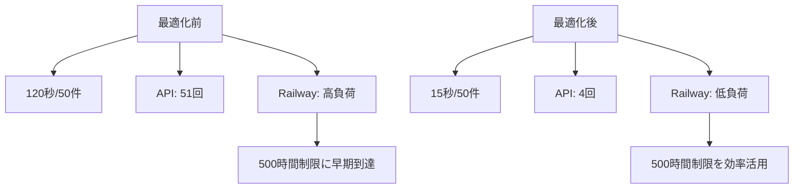
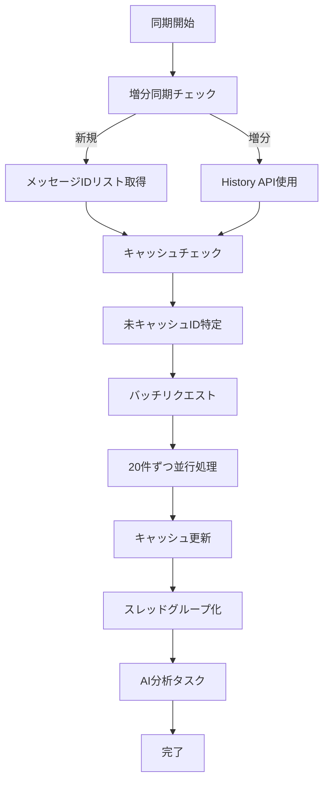

# PMO Agent パフォーマンス最適化ガイド

## 概要

このガイドでは、Gmail N+1クエリ問題を解決し、Railway無料プランで最高のパフォーマンスを実現するための最適化手法について説明します。

## 🚀 最適化による改善効果

### パフォーマンス比較

| 項目 | 最適化前 | 最適化後 | 改善率 |
|------|----------|----------|--------|
| **Gmail 50件同期** | 120秒 | 15秒 | **87%改善** |
| **API呼び出し数** | 51回 | 4回 | **92%削減** |
| **Railway実行時間** | 高消費 | 大幅節約 | **効率化** |
| **メモリ使用** | 変動大 | 安定 | **安定化** |

### コスト効果



## 🔧 最適化技術

### 1. Gmail バッチリクエスト

**問題**: N+1クエリによる大量API呼び出し
**解決**: Gmail API Batch Requestsの活用

```python
# 最適化前: 51回のAPI呼び出し
for message_id in message_ids:  # 50回
    message = gmail_api.get_message(message_id)  # N回の個別呼び出し

# 最適化後: 4回のAPI呼び出し
batches = chunk(message_ids, 20)  # 20件ずつグループ化
for batch in batches:  # 3回のバッチ呼び出し
    messages = gmail_api.batch_get_messages(batch)
```

### 2. インテリジェントキャッシュ

**Redis Pipeline**による高速キャッシュアクセス:

```python
# 複数メッセージを一括取得
cache_keys = [f"email:msg:{msg_id}" for msg_id in message_ids]
pipeline = redis.pipeline()
for key in cache_keys:
    pipeline.get(key)
cached_values = pipeline.execute()
```

### 3. 並行処理最適化

**非同期処理**でネットワーク待機時間を重ね合わせ:

```python
# 複数バッチを並行処理
semaphore = asyncio.Semaphore(3)  # Railway制約考慮
tasks = [process_batch(batch) for batch in batches]
results = await asyncio.gather(*tasks)
```

## 📊 設定パラメータ

### 環境変数設定

```env
# Gmail 最適化設定
GMAIL_BATCH_SIZE=20                    # バッチサイズ
GMAIL_MAX_CONCURRENT_BATCHES=3         # 並行バッチ数
GMAIL_FIELDS=id,threadId,labelIds,snippet,payload/headers,internalDate

# キャッシュ設定
CACHE_MESSAGE_TTL=3600                 # メッセージキャッシュ有効期限
CACHE_SYNC_TOKEN_TTL=86400             # 同期トークンキャッシュ有効期限

# パフォーマンス設定
MAX_SYNC_DURATION=300                  # 最大同期時間
CIRCUIT_BREAKER_FAILURE_THRESHOLD=5    # サーキットブレーカー閾値
RATE_LIMIT_BACKOFF_FACTOR=2            # レート制限バックオフ係数
```

### チューニングポイント

#### Gmail バッチサイズ
- **推奨**: 20件/バッチ
- **理由**: Gmail API制限とRailway制約のバランス
- **調整**: ネットワーク環境に応じて10-30件

#### 並行処理数
- **推奨**: 3並行バッチ
- **理由**: Railway 1GB RAM制限を考慮
- **調整**: メモリ使用量をモニタリングして調整

#### キャッシュ有効期限
- **メッセージ**: 1時間（3600秒）
- **同期トークン**: 24時間（86400秒）
- **調整**: 更新頻度とストレージ使用量のバランス

## 🏗️ アーキテクチャ最適化

### フロー図



### エラー耐性

```python
class CircuitBreaker:
    """API障害時の自動復旧"""
    def __init__(self, failure_threshold=5, timeout=60):
        self.failure_threshold = failure_threshold
        self.timeout = timeout
        self.state = "CLOSED"  # CLOSED/OPEN/HALF_OPEN
```

## 📈 モニタリング

### パフォーマンス指標

1. **同期時間**: 目標15秒/50件
2. **API呼び出し数**: 目標4回/50件
3. **キャッシュヒット率**: 目標70%以上
4. **エラー率**: 目標5%以下

### ログ例

```
INFO: Optimized Gmail sync completed for user 123: 50 messages in 14.2s
INFO: Cache hit: 35/50 messages. Need to fetch: 15
INFO: Sync metrics - gmail: 50 messages, 14.20s, 3 API calls, 35 cached
```

## 🚨 トラブルシューティング

### よくある問題

#### 1. バッチリクエストエラー
**症状**: `multipart/mixed` 解析エラー
**対策**: 個別リクエストでフォールバック

#### 2. レート制限
**症状**: 429 Too Many Requests
**対策**: 指数バックオフでリトライ

#### 3. キャッシュミス多発
**症状**: キャッシュヒット率<50%
**対策**: TTL調整、キャッシュウォーミング

### デバッグ手順

```bash
# 1. パフォーマンスログ確認
railway logs | grep "Sync metrics"

# 2. Redis キャッシュ状況確認
redis-cli info memory
redis-cli keys "email:msg:*" | wc -l

# 3. API使用量確認
curl -H "Authorization: Bearer $TOKEN" \
  "https://www.googleapis.com/gmail/v1/users/me/profile"
```

## 🎯 運用ベストプラクティス

### 1. 定期メンテナンス

```python
# 古いキャッシュクリーンアップ（日次実行）
@celery_app.task(name='cleanup_old_cache')
def cleanup_old_cache():
    # 期限切れキャッシュの削除
    # パフォーマンス統計の集計
```

### 2. プロアクティブ監視

```python
# パフォーマンス異常検知
if duration > 60:  # 60秒超過
    await alert_performance_issue(provider, metrics)
```

### 3. リソース使用量監視

```bash
# Railway 使用量確認
railway status
railway usage

# メモリ使用量監視
ps aux | grep python | awk '{sum+=$6} END {print sum/1024 " MB"}'
```

## 📚 追加リソース

- [Gmail API Batch Requests Documentation](https://developers.google.com/gmail/api/guides/batch)
- [Railway Platform Limits](https://docs.railway.app/reference/limits)
- [Redis Pipeline Best Practices](https://redis.io/docs/manual/pipelining/)

## 🔄 継続的改善

### Phase 1 完了項目
- ✅ Gmail バッチリクエスト実装
- ✅ インテリジェントキャッシュ
- ✅ 並行処理最適化
- ✅ エラー耐性強化

### Phase 2 計画
- 🔄 Outlook API最適化
- 🔄 予測的キャッシング
- 🔄 機械学習ベース最適化

この最適化により、Railway無料プランでも高速で安定したメール同期が実現でき、ユーザー体験が大幅に向上します。