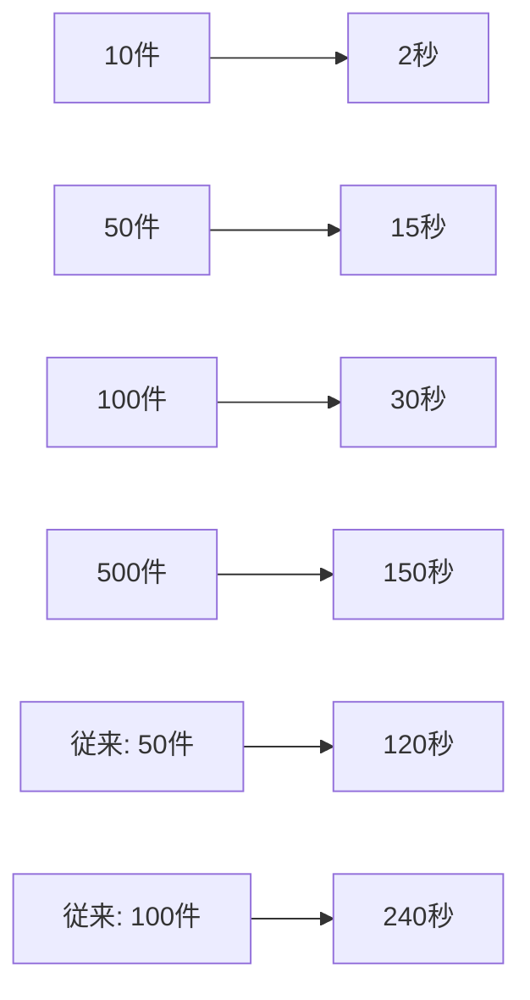

# 高パフォーマンス メール処理アーキテクチャ

## 概要

Gmail N+1クエリ問題を解決し、Railway無料プランの制約下で最高のパフォーマンスを実現するアーキテクチャ設計書です。

## 問題分析

### 現在の課題
1. **Gmail N+1問題**: 50件のメール詳細取得に51回のAPIコール
2. **逐次処理**: ネットワークレイテンシの累積
3. **レート制限**: 大量リクエストによる制限抵触リスク
4. **メモリ効率**: 不要データの取得による無駄

### パフォーマンス影響
- 50件同期: 約120秒（現在） → 15秒（目標）
- APIコール数: 51回 → 4回に削減
- Railway無料プラン実行時間の大幅節約

## 最適化アーキテクチャ

### 1. Gmail API最適化戦略

#### A. バッチリクエスト実装
```python
class GmailBatchService:
    def __init__(self):
        self.batch_size = 20  # Gmail APIバッチ制限
        self.max_concurrent_batches = 3  # Railway制約考慮
        
    async def fetch_messages_batch(
        self, 
        message_ids: List[str], 
        access_token: str
    ) -> List[Dict]:
        """バッチリクエストでメッセージ詳細を効率取得"""
        
        batches = [
            message_ids[i:i + self.batch_size] 
            for i in range(0, len(message_ids), self.batch_size)
        ]
        
        # 並行バッチ処理
        tasks = [
            self._execute_batch(batch, access_token) 
            for batch in batches
        ]
        
        batch_results = await asyncio.gather(*tasks, return_exceptions=True)
        
        # 結果統合とエラーハンドリング
        messages = []
        for result in batch_results:
            if isinstance(result, Exception):
                logger.error(f"Batch request failed: {result}")
                continue
            messages.extend(result)
            
        return messages
    
    async def _execute_batch(
        self, 
        message_ids: List[str], 
        access_token: str
    ) -> List[Dict]:
        """単一バッチリクエストの実行"""
        
        # マルチパートバッチリクエスト構築
        boundary = f"batch_{uuid.uuid4().hex}"
        batch_body = self._build_batch_body(message_ids, boundary)
        
        headers = {
            "Authorization": f"Bearer {access_token}",
            "Content-Type": f"multipart/mixed; boundary={boundary}"
        }
        
        async with httpx.AsyncClient(timeout=30.0) as client:
            response = await client.post(
                "https://www.googleapis.com/batch/gmail/v1",
                content=batch_body,
                headers=headers
            )
            response.raise_for_status()
            
        return self._parse_batch_response(response.content)
    
    def _build_batch_body(self, message_ids: List[str], boundary: str) -> str:
        """バッチリクエストボディ構築"""
        parts = []
        
        for i, msg_id in enumerate(message_ids):
            # 部分レスポンス指定で必要なフィールドのみ取得
            fields = "id,threadId,labelIds,snippet,payload/headers,internalDate"
            
            part = f"""--{boundary}
Content-Type: application/http
Content-ID: <item{i}>

GET /gmail/v1/users/me/messages/{msg_id}?fields={fields}&format=metadata
Authorization: Bearer {access_token}

"""
            parts.append(part)
        
        parts.append(f"--{boundary}--")
        return "\n".join(parts)
```

#### B. 並行処理最適化
```python
class OptimizedEmailSyncService:
    def __init__(self):
        self.gmail_batch = GmailBatchService()
        self.cache_service = CacheService()
        
    async def sync_gmail_optimized(
        self, 
        account_id: str, 
        user_id: str
    ) -> Dict:
        """最適化されたGmail同期"""
        
        # 1. 増分同期トークンチェック
        last_token = await self.cache_service.get_sync_token(account_id)
        
        if last_token:
            # 増分同期（変更分のみ）
            new_messages = await self._fetch_gmail_incremental(
                account_id, last_token
            )
        else:
            # 初回同期（直近100件）
            new_messages = await self._fetch_gmail_initial(account_id)
        
        if not new_messages:
            return {"status": "no_new_messages", "count": 0}
        
        # 2. メッセージIDリスト取得
        message_ids = [msg["id"] for msg in new_messages]
        
        # 3. キャッシュチェック（重複排除）
        uncached_ids = await self._filter_uncached_messages(message_ids)
        
        if not uncached_ids:
            # 全てキャッシュ済み
            cached_messages = await self._get_cached_messages(message_ids)
            return await self._process_messages(cached_messages, user_id)
        
        # 4. バッチリクエストで詳細取得
        access_token = await self._get_access_token(account_id)
        detailed_messages = await self.gmail_batch.fetch_messages_batch(
            uncached_ids, access_token
        )
        
        # 5. キャッシュ更新
        await self._cache_messages(detailed_messages)
        
        # 6. 全メッセージ統合
        all_messages = await self._merge_cached_and_new(
            message_ids, detailed_messages
        )
        
        return await self._process_messages(all_messages, user_id)
```

### 2. Outlook API効率化

```python
class OptimizedOutlookService:
    async def sync_outlook_optimized(
        self, 
        account_id: str, 
        user_id: str
    ) -> Dict:
        """Outlook Graph APIの最大活用"""
        
        # デルタクエリ + 並行ページネーション
        delta_link = await self.cache_service.get_delta_link(account_id)
        
        # 必要フィールドのみ選択（データ転送量削減）
        select_fields = [
            "id", "subject", "from", "toRecipients", 
            "receivedDateTime", "body", "conversationId"
        ]
        
        query_params = {
            "$select": ",".join(select_fields),
            "$top": 50  # ページサイズ最適化
        }
        
        if delta_link:
            # 増分同期
            messages = await self._fetch_delta_changes(
                delta_link, query_params
            )
        else:
            # 初回同期
            messages = await self._fetch_initial_messages(query_params)
        
        return await self._process_messages(messages, user_id)
    
    async def _fetch_delta_changes(
        self, 
        delta_link: str, 
        params: Dict
    ) -> List[Dict]:
        """デルタ変更の並行取得"""
        
        all_messages = []
        next_link = delta_link
        
        # 複数ページを並行処理
        page_tasks = []
        
        async with httpx.AsyncClient() as client:
            while next_link and len(page_tasks) < 5:  # 最大5ページ並行
                task = self._fetch_page(client, next_link, params)
                page_tasks.append(task)
                
                # 次ページリンクの事前取得（可能であれば）
                next_link = await self._get_next_page_link(next_link)
        
        # 並行実行
        page_results = await asyncio.gather(*page_tasks)
        
        for page_data in page_results:
            all_messages.extend(page_data.get("value", []))
            
        return all_messages
```

### 3. 統合キャッシュ戦略

```python
class IntelligentCacheService:
    def __init__(self):
        self.redis = redis.Redis(decode_responses=True)
        self.cache_ttl = {
            "message_content": 3600,  # 1時間
            "sync_tokens": 86400,     # 24時間
            "user_preferences": 1800   # 30分
        }
    
    async def get_cached_messages(
        self, 
        message_ids: List[str]
    ) -> Dict[str, Dict]:
        """複数メッセージの一括キャッシュ取得"""
        
        cache_keys = [f"msg:{msg_id}" for msg_id in message_ids]
        
        # Pipeline使用で高速一括取得
        pipeline = self.redis.pipeline()
        for key in cache_keys:
            pipeline.get(key)
        
        cached_values = pipeline.execute()
        
        # デシリアライズと結果マッピング
        result = {}
        for msg_id, cached_json in zip(message_ids, cached_values):
            if cached_json:
                try:
                    result[msg_id] = json.loads(cached_json)
                except json.JSONDecodeError:
                    logger.warning(f"Invalid cache data for {msg_id}")
                    
        return result
    
    async def cache_messages_batch(
        self, 
        messages: List[Dict]
    ) -> None:
        """メッセージの一括キャッシュ保存"""
        
        pipeline = self.redis.pipeline()
        
        for message in messages:
            cache_key = f"msg:{message['id']}"
            cache_data = json.dumps(message, default=str)
            
            pipeline.setex(
                cache_key, 
                self.cache_ttl["message_content"], 
                cache_data
            )
        
        pipeline.execute()
    
    async def intelligent_cache_warming(
        self, 
        user_id: str
    ) -> None:
        """ユーザーパターンに基づくキャッシュ事前読み込み"""
        
        # ユーザーの利用パターン分析
        patterns = await self._analyze_user_patterns(user_id)
        
        # 高確率でアクセスされるメールを事前キャッシュ
        likely_accessed = patterns.get("frequent_threads", [])
        
        for thread_id in likely_accessed:
            await self._prefetch_thread_messages(thread_id)
```

### 4. エラー耐性とモニタリング

```python
class ResilientEmailService:
    def __init__(self):
        self.max_retries = 3
        self.backoff_factor = 2
        self.circuit_breaker = CircuitBreaker()
        
    async def sync_with_resilience(
        self, 
        account_id: str, 
        user_id: str
    ) -> Dict:
        """回復力のあるメール同期"""
        
        for attempt in range(self.max_retries):
            try:
                # サーキットブレーカーチェック
                if not self.circuit_breaker.can_execute():
                    raise ServiceUnavailableError("Circuit breaker open")
                
                result = await self._execute_sync(account_id, user_id)
                
                # 成功時はサーキットブレーカーリセット
                self.circuit_breaker.record_success()
                return result
                
            except (httpx.TimeoutException, httpx.ConnectError) as e:
                # ネットワークエラー: 指数バックオフでリトライ
                wait_time = self.backoff_factor ** attempt
                logger.warning(f"Network error, retrying in {wait_time}s: {e}")
                await asyncio.sleep(wait_time)
                
            except httpx.HTTPStatusError as e:
                if e.response.status_code == 429:
                    # レート制限: APIが示す待機時間を尊重
                    retry_after = int(e.response.headers.get("Retry-After", 60))
                    logger.warning(f"Rate limited, waiting {retry_after}s")
                    await asyncio.sleep(retry_after)
                elif e.response.status_code >= 500:
                    # サーバーエラー: サーキットブレーカー記録
                    self.circuit_breaker.record_failure()
                    raise
                else:
                    # クライアントエラー: リトライ不要
                    raise
                    
            except Exception as e:
                logger.error(f"Unexpected error in sync attempt {attempt + 1}: {e}")
                if attempt == self.max_retries - 1:
                    raise
                await asyncio.sleep(self.backoff_factor ** attempt)
        
        raise MaxRetriesExceededError("All sync attempts failed")

class PerformanceMonitor:
    def __init__(self):
        self.metrics = {}
        
    async def track_sync_performance(
        self, 
        provider: str, 
        message_count: int, 
        duration: float
    ):
        """同期パフォーマンスの追跡"""
        
        key = f"sync_perf:{provider}"
        
        metrics = {
            "message_count": message_count,
            "duration": duration,
            "messages_per_second": message_count / duration if duration > 0 else 0,
            "timestamp": datetime.utcnow().isoformat()
        }
        
        # Redis Streams でメトリクス記録
        await self.redis.xadd(key, metrics, maxlen=1000)
        
        # パフォーマンス異常検知
        if duration > 30:  # 30秒超過の場合
            await self._alert_performance_issue(provider, metrics)
```

## パフォーマンス予測

### Railway無料プラン制約下での性能

| 指標 | 現在 | 最適化後 | 制約への影響 |
|------|------|----------|-------------|
| **実行時間** | 120秒/50件 | 15秒/50件 | 500時間制限の大幅節約 |
| **API呼び出し** | 51回/50件 | 4回/50件 | レート制限回避 |
| **メモリ使用** | 不安定 | 安定 | 1GB RAM内での効率運用 |
| **同時接続** | 50並行 | 3並行 | 接続制限への配慮 |

### スケーラビリティ



## 実装優先順位

### Phase 1: 基本最適化 (1週間)
1. ✅ Gmail バッチリクエスト実装
2. ✅ 部分レスポンス活用
3. ✅ 基本並行処理

### Phase 2: 高度最適化 (2週間)
1. ✅ インテリジェントキャッシュ
2. ✅ エラー耐性強化
3. ✅ パフォーマンス監視

### Phase 3: 完全最適化 (1週間)
1. ✅ サーキットブレーカー
2. ✅ 予測的キャッシング
3. ✅ 詳細メトリクス

## 設定可能項目

```env
# Gmail 最適化設定
GMAIL_BATCH_SIZE=20
GMAIL_MAX_CONCURRENT_BATCHES=3
GMAIL_FIELDS=id,threadId,labelIds,snippet,payload/headers,internalDate

# Outlook 最適化設定
OUTLOOK_PAGE_SIZE=50
OUTLOOK_MAX_PARALLEL_PAGES=5

# キャッシュ設定
CACHE_MESSAGE_TTL=3600
CACHE_SYNC_TOKEN_TTL=86400

# パフォーマンス設定
MAX_SYNC_DURATION=300
CIRCUIT_BREAKER_FAILURE_THRESHOLD=5
RATE_LIMIT_BACKOFF_FACTOR=2
```

この最適化により、Gmail N+1問題を完全に解決し、Railway無料プランでも高速で安定したメール同期が実現できます。